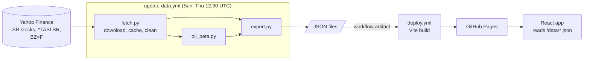

# Tadawul Pulse · نبض تداول

Systematic research on the Saudi stock market (TASI), published as a free static site on GitHub Pages. A scheduled GitHub Actions job runs a Python pipeline that writes JSON files, and a React frontend reads them. There is no backend server.

> **For research and education only. Not investment advice.**


<!-- TODO: add a screenshot at docs/screenshot.png -->

## What's in it

| Page | Status | What it shows |
|---|---|---|
| Overview (`HOME`) | ✅ Phase 1 | TASI candlesticks and Brent, headline stats, movers, breadth, a monitor of every stock, data-cleaning summary |
| Oil beta (`BETA`) | ✅ Phase 1 | Rolling 60/120-day betas of ~60 stocks to Brent and TASI, sector averages, per-stock history |
| Factors (`FACT`) | Phase 2 | Momentum, low-volatility and dividend-yield portfolios vs TASI |
| Seasonality (`SEAS`) | Phase 3 | Ramadan, Eid and Hijri-month effects, with significance tests |
| Pairs (`PAIR`) | Phase 4 | Within-sector cointegration pairs, out-of-sample backtest |

English and Arabic (full right-to-left layout).

## Interface

The site is styled like a trading-desk terminal: black background, amber text, dense grids of square panels with dark-blue title bars, and monospace type (IBM Plex Mono, with IBM Plex Sans Arabic for Arabic text). It's inspired by financial terminals in general and isn't affiliated with any terminal vendor.

| Control | What it does |
|---|---|
| Command bar (top) | Type a ticker (`2222`), part of a name (`rajhi`, `الراجحي`) or a page code, then press Enter. Suggestions appear as you type; use ↑/↓ to choose. `/` focuses it from anywhere, and typing a letter or digit with nothing else focused starts a command. `Esc` clears it. |
| Page codes | `HOME` market overview · `BETA` oil beta monitor · `FACT` factors · `SEAS` seasonality · `PAIR` pairs |
| Function keys (bottom) | `F1` HOME, `F2` BETA, `F3` FACT, `F4` SEAS, `F5` PAIR. Click them or press the real keys. |
| Ticker tape | TASI and every stock's last price and daily change. Hover to pause; click an item to open it. |
| Status bar | Riyadh clock, market status, data date, and the research disclaimer. Market status follows the Sun–Thu 10:00–15:00 schedule and doesn't know about public holidays. |

Colours: green `#00C853` up, red `#FF3D00` down, white unchanged, everywhere including charts. Oil beta is amber and market beta is cyan.

### Changing the palette

Every colour is defined once, as a CSS variable in [`web/src/styles/theme.css`](web/src/styles/theme.css). Tailwind ([`web/tailwind.config.js`](web/tailwind.config.js)) maps its colour names to those variables, and the chart code reads the same variables at runtime, so editing a value in `theme.css` restyles text, panels, tables and both chart libraries. Sector colours are the `--s-*` variables in the same file.

## Architecture



```
tadawul-pulse/
├── pipeline/            Python 3.11
│   ├── config.py        universe, sectors, Shariah flags, every parameter
│   ├── fetch.py         download + cleaning + caching + trading calendar
│   ├── oil_beta.py      rolling oil and market betas
│   └── export.py        entry point; writes JSON to web/public/data/
├── tests/               pytest
├── web/                 React + Vite + TypeScript + Tailwind
└── .github/workflows/
    ├── update-data.yml  scheduled pipeline run, uploads data artifact
    └── deploy.yml       builds the site with the latest data, deploys to Pages
```

The data files are **not committed**. `update-data.yml` uploads them as a workflow artifact (kept 30 days) and `deploy.yml` downloads the most recent successful one before building. This keeps the repository small; committing a fresh set of JSON files every trading day would add hundreds of MB of history a year.

## Run it locally

Requirements: Python 3.11+, Node 20+.

```bash
# 1. Pipeline
python -m venv .venv && source .venv/bin/activate
pip install -r requirements.txt
python -m pytest -q
python -m pipeline.export          # real data from Yahoo (a few minutes the first time)
# or: python -m pipeline.export --synthetic   # generated demo data, no network
# add -v to log every individual cleaning action

# 2. Website
cd web
npm install
npm run dev                        # http://localhost:5173/tadawul-pulse/
```

Downloads are cached in `.cache/prices/` for 12 hours (`CACHE_TTL_HOURS`). Use `--no-cache` to force a fresh download.

## Deploy to GitHub Pages

**One command:** `ship.sh` creates the repo, pushes it, sets Pages to GitHub Actions and starts the first data run.

```bash
read -s "GITHUB_TOKEN?Paste token: " && export GITHUB_TOKEN   # zsh; in bash use: read -s GITHUB_TOKEN && export GITHUB_TOKEN
bash ship.sh                 # or: bash ship.sh my-repo-name
```

The token needs the `repo` and `workflow` scopes (classic), or Contents, Workflows, Pages and Actions set to read and write (fine-grained).

**By hand:**

1. Push the repository to GitHub.
2. **Settings → Pages → Build and deployment → Source: GitHub Actions.**
3. **Actions → Update data → Run workflow.** When it finishes, *Deploy site* starts automatically.
4. The site is live at `https://<user>.github.io/<repo>/`. The base path is set from the repository name, so renaming the repo just works.

After that, data refreshes every Sunday–Thursday at 12:30 UTC and the site redeploys on its own. Pushing changes under `web/` also redeploys, using the latest data artifact.

If no data run has succeeded in the last 30 days, the artifact expires and the site shows “No data yet” until the next run.

## Methodology

### Trading calendar
Tadawul trades Sunday to Thursday. The calendar is every date TASI has a close on Yahoo, plus any Sunday–Thursday date on which at least half the universe traded (covers missing index rows). No part of the pipeline assumes a Monday–Friday week. The data starts in 2015, after the June 2013 move from a Saturday–Wednesday week.

### Cleaning
For each stock, in order:
1. Drop non-positive or non-finite closes.
2. Drop rows that fall on Friday or Saturday.
3. Drop zero-volume days (Yahoo often repeats the previous close on days a stock didn't trade).
4. **Remove bad prints**: a move beyond ±10.5% that reverses by more than ±10.5% the next day. Tadawul's ±10% daily limit makes this pattern impossible from real trading.
5. **Flag** any remaining move beyond ±10.5%. These are usually corporate actions Yahoo didn't adjust for (rights issues, bonus shares) or first-day listings. The price is kept, but that day's return is excluded from all statistics.
6. Align to the calendar and forward-fill only gaps of **3 trading days or fewer**. Longer gaps are left empty rather than partly filled, and a gap at the end is never filled. A return is only used when both of its endpoints are real observations.

Every action is counted per ticker in `quality.json` and summarised on the Overview page.

### Oil beta and market beta
Both are OLS slopes on daily log returns over rolling 60- and 120-day windows, requiring at least 80% of the window to be usable returns.

- **Market beta**: the stock's return on the same-day TASI return.
- **Oil beta**: Brent (BZ=F) trades Monday to Friday, so each Saudi date is paired with the latest Brent close on or before it. A Sunday return is paired with Brent's Thursday→Friday move. Tadawul closes at 15:00 Riyadh time, hours before Brent settles in London, so part of each day's oil move only reaches Saudi prices the next day. By default the oil beta is a **Dimson beta**: the stock return is regressed on the same-day and prior-day Brent returns and the two slopes are summed. Set `OIL_BETA_METHOD = "same_day"` in `config.py` for the plain univariate version.

Current values older than 10 trading days are reported as empty.

## Known data limitations

- **Yahoo Finance is unofficial.** Saudi data can be late, have gaps, or change retroactively. Tickers occasionally stop returning data.
- **Corporate actions.** Yahoo's adjustment for Saudi bonus-share issues and rights issues is inconsistent. The cleaning step flags the resulting jumps but can't repair the price history.
- **Survivorship bias.** The universe is today's list of liquid stocks. Delisted and merged companies (e.g. the pre-2021 NCB and Samba) are missing.
- **Recent listings** such as ADES and Arabian Drilling have short histories, so their 120-day betas start later.
- **TASI includes the stocks being measured.** Aramco and Al Rajhi are large index weights, which pushes their market betas towards 1.
- **Shariah flags and some sector labels need checking.** See the `TODO` comments in `pipeline/config.py`. Screening standards differ and lists are revised quarterly.

## Configuration

Everything tunable is in [`pipeline/config.py`](pipeline/config.py): the universe (ticker, English and Arabic names, sector, Shariah flag), start date, cleaning thresholds, beta windows and method, and export settings.

## License

MIT
